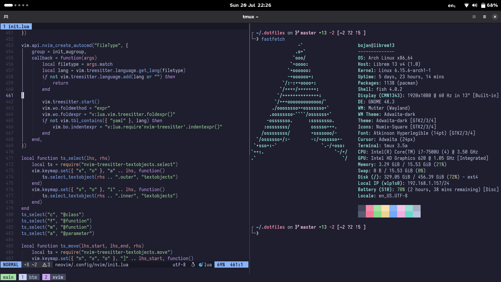

# Dotfiles

**My personal dotfiles, ready to be [stowed](https://www.gnu.org/software/stow/).**



## Setup

The dotfiles are separated into directories—one for each program.
That way, they are neatly organized, and it is also possible to
[use GNU Stow to create symlinks quickly](http://brandon.invergo.net/news/2012-05-26-using-gnu-stow-to-manage-your-dotfiles.html).

```bash
git clone 'https://github.com/BojanStipic/dotfiles' ~/.dotfiles
cd ~/.dotfiles
stow --no-folding -v */ # Trailing slash is important to expand only directories
```
